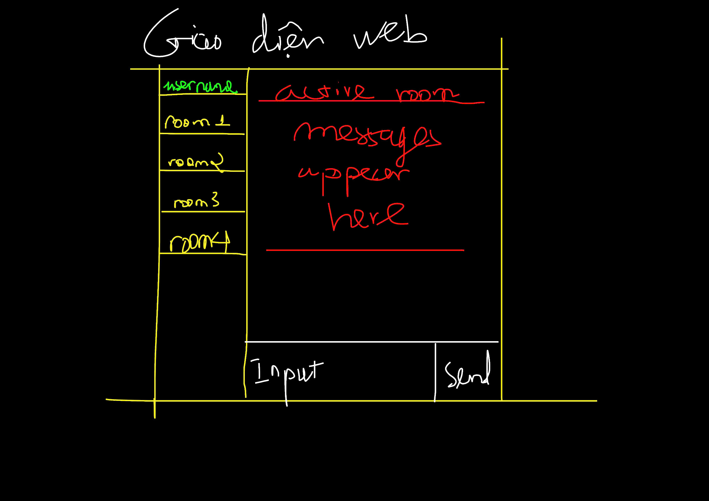

## Chat app with multiple rooms

### Our Design about this app




## Quick start

```json
  "scripts": {
    "start": "node app.js",
    "dev": "nodemon app.js"
  }
```

Start with command: `npm run dev` or `npm start` without auto reloading when something has changed.

